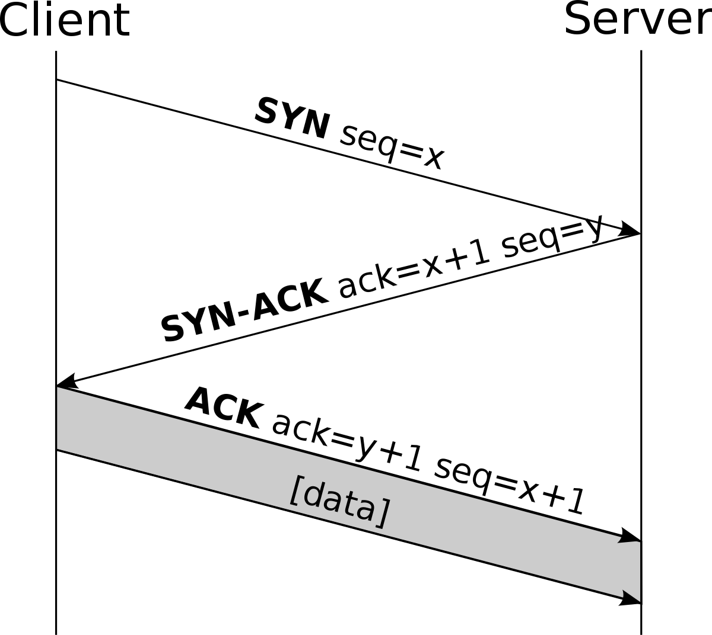

# 1. Network Fundamentals

```
1.1 Explain the role and function of network components
    1.1.a Routers 
    1.1.b Layer 2 and Layer 3 switches
    1.1.c Next-generation firewalls and IPS
    1.1.d Access points
    1.1.e Controllers (Cisco DNA Center and WLC)
    1.1.f Endpoints
    1.1.g Servers
    1.1.h PoE

1.2 Describe characteristics of network topology architectures
    1.2.a Two-tier
    1.2.b Three-tier
    1.2.c Spine-leaf
    1.2.d WAN
    1.2.e Small office/home office (SOHO)
    1.2.f On-premise and cloud

1.3 Compare physical interface and cabling types
    1.3.a Single-mode fiber, multimode fiber, copper
    1.3.b Connections (Ethernet shared media and point-to-point)

1.4 Identify interface and cable issues (collisions, errors, mismatch duplex, and/or speed)

1.5 Compare TCP to UDP

1.6 Configure and verify IPv4 addressing and subnetting

1.7 Describe the need for private IPv4 addressing

1.8 Configure and verify IPv6 addressing and prefix

1.9 Describe IPv6 address types
    1.9.a Unicast (global, unique local, and link local)
    1.9.b Anycast
    1.9.c Multicast
    1.9.d Modified EUI 64

1.10 Verify IP parameters for Client OS (Windows, Mac OS, Linux)

1.11 Describe wireless principles
    1.11.a Nonoverlapping Wi-Fi channels
    1.11.b SSID
    1.11.c RF
    1.11.d Encryption

1.12 Explain virtualization fundamentals (server virtualization, containers, and VRFs)

1.13 Describe switching concepts
    1.14 MAC learning and aging
    1.15 Frame switching
    1.16 Frame flooding
    1.17 MAC address table
```

- [What is a Network](#what-is-a-network)
    - [Create a network](#create-a-network)
- [internet vs Internet](#internet-vs-internet)
    - [Lower case](#lower-case)
    - [Upper case](#upper-case)
- [Network Traffic](#network-traffic)
- [Network Components](#network-components)
- [Client Server Model](#client-server-model)
- [Peer to Peer Model](#peer-to-peer-model)
- [Network sizes](#network-sizes)
    - [Other categories](#other-categories)
- [Routers and Switches](#routers-and-switches)
    - [Home Routers](#home-routers)
- [Firewalls](#firewalls)
    - [Next-Generation Firewalls](#next-generation-firewalls)
- [OSI model](#osi-model)
- [PDU](#pdu)
    - [Encapsulation And Decapsulation](#encapsulation-and-decapsulation)
    - [Application Layer (Layer 7)](#application-layer-layer-7)
    - [Presentation Layer (Layer 6)](#presentation-layer-layer-6)
    - [Session Layer (Layer 5)](#session-layer-layer-5)
    - [Transport Layer (Layer 4)](#transport-layer-layer-4)
    - [Network Layer (Layer 3)](#network-layer-layer-3)
    - [Data Link Layer (Layer 2)](#data-link-layer-layer-2)
    - [Physical Layer (Layer 1)](#physical-layer-layer-1)
- [TCP/IP model](#tcp/ip-model)
    - [Application Layer Protocols](#application-layer-protocols)
    - [Transport Layer Protocols](#transport-layer-protocols)
    - [Internet Layer Protocols](#internet-layer-protocols)
    - [Network Access Layer Protocol](#network-access-layer-protocol)

## What is a Network

The [RFC1392 Internet Users' Glossary](https://www.rfc-editor.org/rfc/rfc1392), a network is described as:

```
network
    A computer network is a data communications system which interconnects computer systems at various different sites.
```

### Create a network

We have two computer that we want to communicate:\
🖥️💻

And we have a cable:\
➿

Let's connect the cable in both computers:\
🖥️➿💻

There you go, this is a network. Of course each computer needs the software to understand and set the rules to start a conversation (share data), although this is already in all computer, but this a basic but still a valid network!.

You can think, oh! but I cannot access youtube I can only access the data in the other computer, you are correct, but we are talking about a network (a system that interconnects computers) not the Internet.

> Note: Nowadays, in the virtual world, you can have a network inside a single computer, for example you can have several virtual machines in one single physical computer and then create a network to connect your virtual machines. Another popular option is use containers, container are lightweight, portable, and isolated environment for running applications, you can also create networks to connect containers. A popular tool that simplifies the creation, deployment, and running of applications using containers is Docker but there are some others. Don't worry, the CCNA exam is not about virtual machines nor Containers.

## internet vs Internet

On the regular basis there are no differences between the word internet (lower "i") and Internet (capital "i"), however the technical (again, not common) [RFC1392 Internet Users' Glossary](https://www.rfc-editor.org/rfc/rfc1392) specifies a difference:

### Lower case
```
internet
      While an internet is a network, the term "internet" is usually used to refer to a collection of networks interconnected with routers.
```

> Note: a Router is a device that interconnects other devices, you will learn more about Routers later.

The term "internet" is derived from `internetwork`, which essentially means a network of networks. The lowercase "internet" refers to any interconnected set of networks

### Upper case
```
 Internet
      (note the capital "I") The Internet is the largest internet in the world.
```

Usually people always talk about Internet.

## Network Traffic

Network traffic refers to the data transmitted across a network.

## Protocols

Human communication have implicit and explicit rules:

- Medium: air
- Language: English, spanish, etc.
- Speed: how much information I can say in a period of time.
- Turn: I speak first, then you, me again, etc. etc.

In networking a protocol refers to a set of rules and conventions that govern communication between devices.

These rules define how data is formatted, transmitted, received, and interpreted across a network. Protocols ensure that devices can exchange information reliably and efficiently.

## Network Components

Networks are composed of three fundamental components:

- **Devices**: these are the source and destination of the information.
    - **End devices**: Personal PC, cellphone, IP camera, IP telephone, etc.
    - **Intermediary devices**: These devices interconnect end devices, e.g: Routers, Switches, Firewalls, etc.
- **Media**: These are the channels where data flows.
    - **Electric pulses**: copper cables like coax, twisted pair cables like UTP or FTP cables, etc.
    - **Light pulses**: Fiber Optic.
    - **Radio waves** (electromagnetic waves): wifi, bluetooth
- **Services and Processes**:
    - **Services** include many of the common network applications people use every day, like email hosting services and web hosting services.
    - **Processes** provide the functionality that directs and moves the messages through the network. Processes are less obvious to us but are critical to the operation of networks.

> Cisco has this article available to the public about this topic: https://www.ciscopress.com/articles/article.asp?p=2755711&seqNum=5

## Client Server Model

The Client-Server Model is a way to understand the role of a computer in a communication system.

- Client: A device with software installed capable to ask a service.
- Server: A device with software installed capable to provide a service.

Both client and server are computers but depending on the actions they performed they are identified with one or other.

Example 1:

There's only one printer in my office and it is used by all employees, the printer is connected to the network so all employees can access the printer from their computers.

🖥️➿🖨️

A printer is a computer, of course do nto expect to play a video game on it, but it has a computer inside.

In this example the printer acts as a server by providing a service to the computers, the employees' computers are clients, they consume the printer services.

Example 2:

My friend is learning web development and mande a basic web page, he is running the web page in his personal computer and since we are connected to the same network he send me the link to access the page. In this example his computer is a server, it has software that allows computer to ask for the web page, my computer is a client, it has a web browser that consumes web services.

Of course there are physical devices with the latest technology and a bunch of memory and CPU, these devices are the ones that are more commonly known as Servers, but again, all are computers, what defines if a computer is a server or a client is the role they play (serve or consume).

**INTERESTING**: what if I have a network with to computers, PC-A and PC-B

- PC-A asks for an image to PC-B, PC-B sends the image
- then PC-B asks for a video to PC-A, PC-A sends the video

Who is the client and who is the server?

When computers act as Clients and Servers at the same time we are in the presence of a different model, the Peer to Peer model.

## Peer to Peer Model

A networking model where participants are called Peers. Peers interact with directly with each other, sharing resources such as files, processing power, or data without the need for a central server.

In this model, each peer can act as both a client and a server, enabling direct communication and resource sharing among all connected nodes.

## Network sizes

- **LAN (Local Area Network)**: A LAN is a network that typically spans a relatively small area, such as a home, office, or a group of buildings in close proximity. It allows computers and devices to communicate and share resources like files, printers, and internet connections within the same location.
    - Your home network is a LAN that connects a few devices, of course this small LAN has connectivity to the Internet.
    - You will discover that in this virtual world we also have something called **VLAN** (Virtual LANs), and in simple words is a logical representation of a LAN (when I say logical I mean based in software). VLANs are useful to logically separate devices and networks. Example: You can create a VLAN for your guests in your home or maybe a VLAN called Family, or any other VLAN to group and separate create virtual LANs.

- **MAN (Metropolitan Area Network)**: A MAN covers a larger geographical area, such as a city or metropolitan area. It connects multiple LANs within a specific region, providing high-speed connections to link these smaller networks together.
    - A provider network can be an example of a MAN (Metropolitan Area Network). Telecommunication companies often create MANs to connect their various offices, data centers, and service points within a metropolitan area. 

- **WAN (Wide Area Network)**: A WAN is a network that covers a broad area, potentially spanning cities, countries, or even continents. It connects multiple LANs and MANs over long distances, utilizing various telecommunication technologies like leased lines, satellites, or internet services to enable communication between geographically distant locations.
    - The Internet is the largest and most expansive example of a WAN (Wide Area Network)

### Other categories

Apart from the size, there are other categories for networks:

- **SAN**: Storage Area Network, these are networks intended to store data and therefore they are optimized for that purpose.
- **PAN**: Personal Area Network, networks designed for short-range communication between devices. Example: Bluetooth.

## Routers and Switches

Routers and Switches are Intermediary network devices.

**Switches** are used to provide connectivity to devices in the same LANs. Switches have a lot of interfaces to connect many end devices.

> An Interface is a port dedicated to network connectivity. Some people usually use the term port and interface interchangeably (of course that is not "technically" correct, but it happens).


The image above shows a RJ45 interface in a laptop (RJ45 is just the name of this specific port, RJ stands for Registered Jack). There are other interfaces similar to the RJ45, example RJ11 is commonly used in telephony.

**Routers** usually have fewer interfaces and that is because Routers are used to provide connectivity for different LANs, so tipically you connect just one or very few interfaces to a switch and other interfaces are used to connect routers.

Router are also the ones that provide connectivity to the Internet.

### Home Routers

Home Routers are actually a combination of a few devices:

- Switch: interconnect devices in a LAN.
- Router: Provide connectivity to the Internet
- Wireless Access Point: have a radio frequency device to connect devices wirelessly, for this reason Home routers are also known as modems (they module and demodule the radio frequencies).

Again, people are not always using the technical jargon son it is fine you call it Router or Modem although it is actually a combination of devices (of course with pretty basic characteristics)

Modem also provide services, for example:

- DHC server
- DNS server
- Firewall: firewalls can be physical or logical (which is the case of the home routers)

> You will learn more about these service in the future, no need to learn them now.

## Firewalls

Firewall monitor and control network traffic (data sent from one device to another device) based on configured rules.

Firewalls can block traffic if it doesn't match the rules.

Firewalls can be stand alone appliances or software based programs that run on machines, e.g. Windows have an already installed firewall that you can configure in your personal computer.

Your home Router usually have a software based firewall integrated.

Firewalls that are based in software are called **host-based firewalls**.

### Next-Generation Firewalls

When Firewall include modern and advanced filtering capabilities are called Nex-Generation Firewalls.

Cisco has two popular Next Gen Firewalls:

- ASA5500-X
- Firepower 2100

## OSI model

THE Open Systems Interconnect Model is a standard of the International Organization for Standardization (ISO).

It is a general-purpose framework that characterizes and standardizes how computer communicate with one another over a network.

The OSI model has 7 layers and is represented as a stack where layer 1 is at the bottom and layer 7 at the top:

```
7. Application
6. Presentation
5. Session
4. Transporte
3. Network
2. Data Link Access
1. Physical
```

> A common joke is to say Layer 8 is for the user, and people into IT community say "we have a Layer 8 issue" when a user was the responsible for an issue.

**IMPORTANT: The OSI is a conceptual model, it is not a physicial thing or a protocol suite or technology**

### OSI Model benefits

- New technologies don't need end to end from top to bottom of the model, new technologies just need to work at a specific layer and make sure they can interact with the adjacent layers.
- Troubleshooting: You can detect issues in a logical fashion layer by layer.
- Interoperability: technologies can interact even if the are from different vendors, e.g. you can connect your iphone to a bose speaker via bluetooth even when they belong to different companies but bluetooth is an open standard.

### PDU

A Protocol Data Unit it's a specific unit of data at a specific layer.

Each layer in the networking stack **encapsulates** the data it receives from the upper layer into its own PDU by adding necessary control information. As this PDU moves down the stack, each layer further encapsulates the data until it's transmitted over the network medium.


|Layer|PDU name|
|---|---|
|7. Application|Data|
|6. Presentation|Data|
|5. Session|Data|
|4. Transport|Segment|
|3. Network|Packet|
|2. Data Link Access|Frame|
|1. Physical|Bits|

Layers 7, 6 4 are know as the `upper layers`, developer are more used to this layers than network engineers.

Layer 1 to 5 are known as the `lower layers`, these are the layers that network engineers care most of the time.

### Encapsulation And Decapsulation

- **Encapsulation**: It's the process of adding headers (and sometimes trailers) to data as it moves down through the layers of the network stack. Each layer adds its own header to the data received from the upper layer, forming a new PDU (Protocol Data Unit) specific to that layer. This encapsulation continues until the data is ready to be transmitted over the network medium.

- **Decapsulation** (or De-encapsulation): Conversely, decapsulation is the process of removing these added headers (and trailers) as data is received at the destination. As the data moves up through the layers of the receiving device's network stack, each layer examines and strips off the headers relevant to its operation, until the original data from the sender is retrieved.


### Application Layer (Layer 7)

This layer interacts directly with the end-user and **provides network services**.

It includes protocols for file transfers, email services, browsing the web (e.g., HTTP, FTP, SMTP), and other user applications.

❌ Web browsers are not part of Layer 7\
✔️ Web browser use network services at layer 7, e.g. HTTP.

If you want a crash course about HTTP you can visit this lecture: [HTTP](./http.md).

### Presentation Layer (Layer 6)

This layer handles:

 - **Data translation**: Data is converted in a format that is understandable by the receipt.
 - **Encryption**: securing data by converting it into a format that is unreadable 
 - **Compression**: reduces the size of the data to be transmitted.

It ensures that data sent by one application is readable by another, dealing with differences in data formats between different systems.

IMPORTANT: the presentation layer is described as a layer that handle, data translation, encryption and compression but do not expect to see a header in the PDU about this, remember that the OSI model is just a reference to explain the steps that are done to sent a message, so the OSI model is NOT saying "this is part of the PDU".

### Session Layer (Layer 5)

This layer establishes, manages, and terminates communication sessions between devices. It allows for synchronization, checkpointing, and recovery of data exchange.

Again, do not expect to see a header in the Layer 5 PDU, actually the TCP protocol is used to control messages to synchronize and establish a connection but the TCP protocol is on Layer 4!, so ONE MORE TIME: use the OSI model just as a reference to explain what is done but not how is done.

### Transport Layer (Layer 4)

This layer ensures end-to-end communication by **segmenting** and reassembling data into a format the upper layers can use.

It manages:
- Flow control
- Error checking
- Data integrity

Protocols like TCP (Transmission Control Protocol) and UDP (User Datagram Protocol) are part of this layer.

The transport layer breaks down the PDU of the upper layers into smaller units called segments. The transport layer add information in each segment to identify which segment belongs to which service.

Transport layer allows multiplexing.

#### Multiplexing

Adding data to identify which segment belongs to a service allows us to send multiple segments from different services in the same medium, this is also know as multiplexing.


In the image above we can see how we combine data from multiple services in the same medium.

At layer 4 multiplexing is done by adding a port number as a header of each segment.

A port is a number that identifies a service. e.g. port 80 is typically used for HTTP.

A Source port is added to represent the sender.\
A Destination port is also added to represent the destination.

This is useful because, for example, if you have google in a tab in your web browser and another tab with facebook, both destinations will be to the same port, but the origin port will be different for each tab.

### Network Layer (Layer 3)

The network layer facilitates data routing and determines the best path for data transmission.

It handles *logical* addressing, like IP addresses, and controls the operation of routers. The Internet Protocol (IP) works at this layer.

Key takeaways:

- Routers work at this layer.
- Layer 3 is responsible for IP addressing.
- Layer 3 is responsible for packet forwarding.

### Data Link Layer (Layer 2)

It's responsible for **node-to-node** communication, error detection, and correction in the physical layer.

It frames the raw bits into data frames, manages access to the physical medium, and deals with issues like MAC addresses and Ethernet.

> Layer 3 connect different networks and Layer 2 connect devices in the same network.

Switches work at this layer.


### Physical Layer (Layer 1)

This layer deals with the physical connection between devices and the transmission of **raw** data over a physical medium, such as cables or wireless signals. It defines specifications for hardware like cables, connectors, hubs, and repeaters.

Hubs work at this layer (a hub is a device that broadcasts data to every computer, basically takes a signal and repeats that signal, it does NOT take any decision).

## TCP/IP model

The TCP/IP model refers to the Transmission Control Protocol/Internet Protocol Model, this model defines and references a large collection of protocols that allow computers to communicate. Two of the most important protocols are TCP and IP, hence the name TCP/IP model.

TCP/IP model uses documents called **Requests For Comments (RFC)**, these documents are managed and handled by the Internet Engineering Task Force (**IETF**).

The IETF is responsible for developing and promoting voluntary internet standards, including the publication of RFCs which document various aspects of internet protocols, technologies, and related topics.

TCP was developed during the 60s by the US Department of Defense (DOD) Advanced Research Projects Agency (ARPA).

The TCP/IP model and the OSI model have equivalent layers in operation and function, some layers are grouped in one single layer in the TCP/IP model:


And here are **some** of the protocols:


### Application Layer Protocols

Some of the protocols used in this layer are:

- **HTTP**: Hypertext transfer protocol is used for accessing the information available on the internet.
- **SMTP**: Simple mail transfer protocol, assigned the task of handling e-mail-related steps and issues.
- **FTP**: This is the standard protocol that oversees the transfer of files over the network channel.

### Transport Layer Protocols

The protocols used in this layer are:

- **TCP**: Transmission Control Protocol is responsible for the proper transmission of segments over the communication channel. It also establishes a network connection between the source and destination system.
- **UDP**: User Datagram Protocol is responsible for identifying errors, and other tasks during the transmission of information.

### Internet Layer Protocols

Some of the protocols applied in this layer are:

- **IP**: This protocol assigns your device with a unique address; the IP address is also responsible for routing the data over the communication channel.
- **ARP**: This protocol refers to the Address Resolution Protocol that is responsible for finding the physical address using the IP address.

### Network Access Layer Protocol

This layer is the combination of data-link and physical layer, where it is responsible for maintaining the task of sending and receiving data in raw bits, i.e., in binary format over the physical communication modes in the network channel.

- It uses the physical address of the system for mapping the path of transmission over the network channel.
- Till this point in this tutorial on what is TCP/IP model, you understood the basic idea behind the model and details about its layers, now compare the model with another network model.

## TCP VS UDP

TCP (Transmission Control Protocol) and UDP (User Datagram Protocol) are both protocols used in networking, but they differ significantly in how they handle data transmission:

1. **Reliability:**
   - **TCP:** It's `connection-oriented` and provides reliable, ordered, and error-checked delivery of data. It ensures that data sent is received correctly by the recipient. If data gets lost or corrupted during transmission, TCP will retransmit it.
   - **UDP:** It's `connectionless` and does not guarantee delivery. It's faster but less reliable. UDP doesn't track the packets sent, so there's no guarantee that they will reach the destination or arrive in the same order they were sent.

2. **Speed:**
   - **TCP:** Due to its reliability mechanisms like error checking and retransmission of lost packets, TCP might be slower than UDP. It's optimized for accuracy and completeness of data delivery.
   - **UDP:** It's faster than TCP because it lacks the mechanisms that ensure reliability. Without the need for establishing and maintaining connections or retransmitting lost packets, UDP can be quicker in transmitting data.

3. **Usage:**
   - **TCP:** Commonly used for applications where reliability and data integrity are crucial, such as web browsing, email, file transfer, etc.
   - **UDP:** Ideal for applications that prioritize speed and can tolerate some data loss, like video streaming, online gaming, VoIP (Voice over Internet Protocol), and live broadcasts.

4. **Headers:**
   - **TCP:** Has a relatively larger header size due to additional information needed for reliable transmission, including sequence numbers, acknowledgments, and error-checking fields.
   - **UDP:** Has a smaller header size compared to TCP since it doesn’t have the same overhead for reliability mechanisms.

Choosing between TCP and UDP depends on the specific needs of the application. TCP is more suitable for scenarios where accuracy and completeness of data are vital, while UDP is preferred when speed and real-time delivery are more critical than perfect data integrity.

## CISCO IOS Operating System

Cisco IOS (Internetwork Operating System) is a proprietary operating system used in Cisco networking devices.

Cisco has graphical user interfaces but using the command line is quick faster and more common.

## TCP

```shell

WIP:

|-------------------------------------------|
|  Source Port (16) | Destination Port (16) |
|-------------------------------------------|
|          Sequence Number (32)             |
|-------------------------------------------|
|       Acknowledgment Number (32)          |
|-------------------------------------------|
| Data Offset (4) | Reserved (6) | ControlBits (6)|
|-----------------|--------------|----------|
| Window Size (16) | Checksum (16)         |
|------------------|-----------------------|
| Urgent Pointer (16) | Options (variable)  |
|-------------------------------------------|
|                 Data                      |
|-------------------------------------------|
```

### 3-Way Handshake

The three-way handshake is a fundamental process used by TCP (Transmission Control Protocol) to establish a connection between a client and a server before data transmission begins. It involves three steps:



1. SYN (Synchronize):
    - The client initiates the connection by sending a TCP segment with the SYN (Synchronize) flag set to the server.
    - This segment contains a sequence number (let's call it SeqA) that the client randomly generates. The SYN flag indicates the start of a new connection and informs the server about the client's initial sequence number.

2. SYN-ACK (Synchronize-Acknowledgment):
    - Upon receiving the SYN segment from the client, the server responds with a TCP segment.
    - The server sets the SYN flag and the ACK (Acknowledgment) flag in this segment.
    - The server also generates its own random sequence number (let's call it SeqB) and acknowledges the client's sequence number by incrementing it by one (SeqA + 1). This acknowledgment indicates that the server is willing to receive data from the client starting at SeqA + 1.

3. ACK (Acknowledgment):
    - Finally, the client acknowledges the server's response.
    - It sets the ACK flag and acknowledges the server's sequence number by incrementing it by one (SeqB + 1). This acknowledgment confirms that the client has received the server's response and is ready to start sending data beginning with SeqB + 1.

At this point, the three-way handshake is completed, and a reliable, bidirectional communication channel is established between the client and server. Both sides have exchanged initial sequence numbers (SeqA and SeqB) and confirmed their readiness to communicate by acknowledging each other's sequence numbers. Subsequently, data transmission can occur in both directions over this established TCP connection.


## IPv4 Addresses

Hosts, servers, and network devices use **binary IPv4 addresses** to identify each other.

Each address consists of a string of **32 bits**, divided into 4 sections called **octets**.

### Public and Private Addresses

**Public IPv4 addresses are addresses which are globally routed between ISP (Internet Service Provider) routers.**

There are blocks of addresses called private addresses that are used by most organizations to assign IPv4 addresses to internal hosts (**RFC 1918**).

**It is important to know that private addresses within these address blocks are not allowed on the Internet and must be filtered (discarded) by Internet routers.**

Private ranges:

- `10.0.0.0/8` or 10.0.0.0 to 10.255.255.255
- `172.16.0.0/12` or 172.16.0.0 to 172.31.255.255
- `192.168.0.0/16` or 192.168.0.0 to 192.168.255.255

Network Address Translation (**NAT**) is used to translate between private IPv4 and public IPv4 addresses.

### Special IPv4 Addresses

- **Loopback** addresses (127.0.0.0 /8 or 127.0.0.1 to 127.255.255.254) – More commonly identified as only 127.0.0.1, these are special addresses used by a host to direct traffic to itself
- **Link-Local** addresses (169.254.0.0 /16 or 169.254.0.1 to 169.254.255.254) – More commonly known as the Automatic Private IP Addressing (**APIPA**) addresses, they are used by a Windows DHCP client to self-configure in the event that there are no DHCP servers available.Useful in a peer-to-peer connection.
- **TEST-NET** addresses (**192.0.2.0/24** or 192.0.2.0 to 192.0.2.255) – These addresses are set aside for teaching and learning purposes and can be used in documentation and network examples.
- There are also Experimental Addresses in the block 240.0.0.0 to 255.255.255.254 that are reserved for future use

## IPv6

IPv6 is designed to be the successor to IPv4.

IPv6 has a larger **128-bit** address space, providing for 340 undecillion addresses. (That is the number 340, followed by 36 zeroes.

**IPv6 routing is not enabled by default**. To enable a router as an IPv6 router, the **R1(config)#ipv6 unicast-routing** global configuration command must be used.

### IPv6 Address Types

- **Unicast** - An IPv6 unicast address uniquely identifies an interface on an IPv6-enabled device. A source IPv6 address must be a unicast address.
    - **Global unicast**: this is similar to a public IPv4 address. These are globally unique, Internet routable addresses. Global unicast addresses can be configured statically or assigned dynamically. 
    - **Link-local** address enables a device to communicate with other IPv6-enabled devices on the same link and only on that link (subnet). With IPv6, the term link refers to a subnet. Link-local addresses are confined to a single link. Their uniqueness must only be confirmed on that link because they are **not routable** beyond the link. In other words, routers will not forward packets with a link-local source or destination address. 
    - **Unique local**: IPv6 unique local addresses have some similarity to RFC 1918 private addresses for IPv4, but there are significant differences. Unique local addresses are used for local addressing within a site or between a limited number of sites. These addresses should not be routable in the global IPv6 and should not be translated to a global IPv6 address.
        - Range: FC00::/7 to FDFF::/7
        - Unique local addresses can be used for devices that will never need or have access from another network. 

- **IPv6 multicast** addresses are similar to IPv4 multicast addresses. Recall that a multicast address is used to send a single packet to one or more destinations (multicast group). 
    - **Multicast addresses can only be destination addresses and not source addresses.**
    - IPv6 multicast addresses have the prefix **FF00::/8.**
    - There are **two types **of IPv6 multicast addresses:
        - **Assigned multicast**: 
        - **Solicited node multicast**: