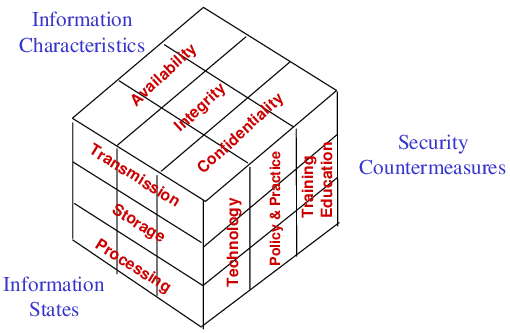

# 5. Security Fundamentals

## CIA Triad

### Confidentiality

#### AAA

- Authenticate
- Authorize
- Accounting

### Integrity
### Availability

### Non-repudiation

Non-repudiation is not part of the CIA triad but is commonly discussed with this concepts.

Non-repudiation is a security principle that ensures that a user cannot deny the authenticity or origin of a message or transaction.

For instance, when someone digitally signs a document using their private key, the recipient can verify it using the sender's public key, ensuring that only the sender could have generated that signature. This helps prevent the sender from later denying their involvement in the transaction or message.

Non-repudiation is typically categorized into two types:

- **Non-Repudiation of Origin**: This ensures that the sender of a message cannot deny sending it. It's often achieved through digital signatures or other cryptographic methods that validate the sender's identity and ensure the integrity of the message.

- **Non-Repudiation of Receipt**: This ensures that the receiver of a message cannot deny receiving it. Receipts or acknowledgment mechanisms, such as digital receipts or timestamps, are used to prove that the message was indeed received by the intended recipient

## McCumber INFOSEC Model

