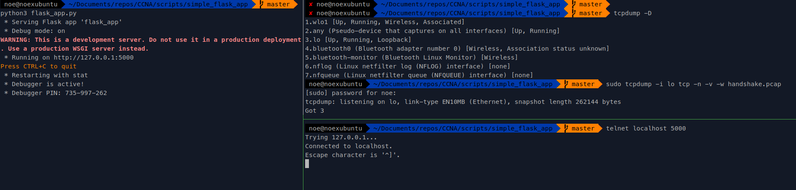
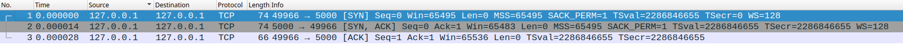
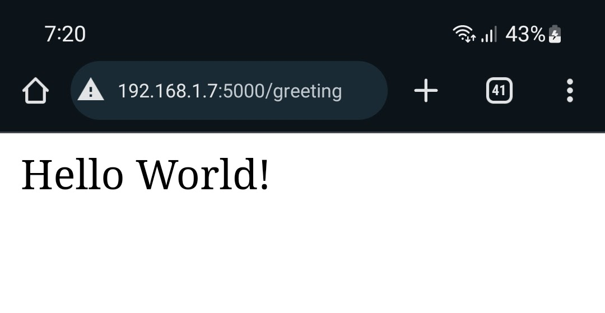
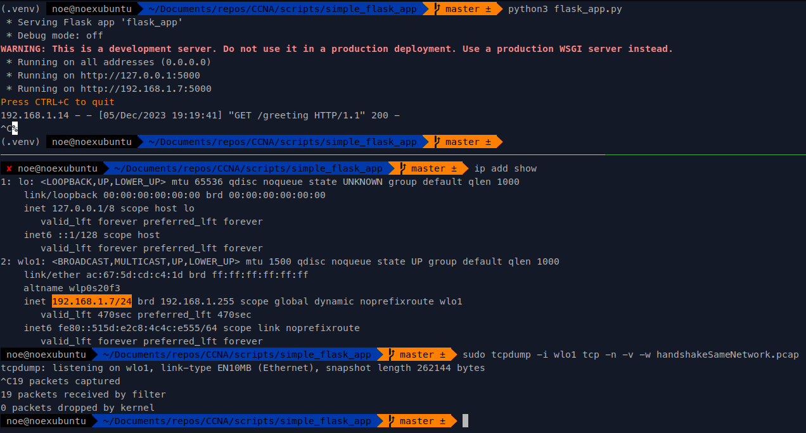
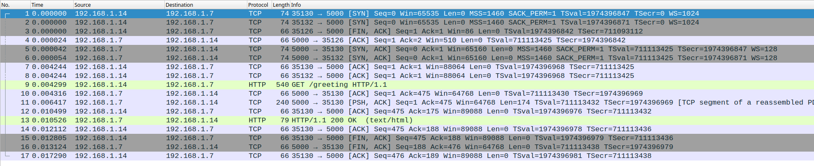

# Lab 3 way handshake

In this practice we are going to explore the TCP 3 way handshake

## Prerequisites:

- Make the [simple_flask](../scripts/simple_flask_app/) project work in your machine.
- Install wireshark
- Install tcpdump

## Steps

1. Run the flask app:

```shell
python3 flask_app.py
 * Serving Flask app 'flask_app'
 * Debug mode: on
WARNING: This is a development server. Do not use it in a production deployment. Use a production WSGI server instead.
 * Running on http://127.0.0.1:5000
Press CTRL+C to quit
 * Restarting with stat
 * Debugger is active!
 * Debugger PIN: 735-997-262
```

2. Start a packet capture:

```shell
$ tcpdump -D                                    
1.wlo1 [Up, Running, Wireless, Associated]
2.any (Pseudo-device that captures on all interfaces) [Up, Running]
3.lo [Up, Running, Loopback]
4.bluetooth0 (Bluetooth adapter number 0) [Wireless, Association status unknown]
5.bluetooth-monitor (Bluetooth Linux Monitor) [Wireless]
6.nflog (Linux netfilter log (NFLOG) interface) [none]
7.nfqueue (Linux netfilter queue (NFQUEUE) interface) [none]
8.dbus-system (D-Bus system bus) [none]
9.dbus-session (D-Bus session bus) [none]

$ sudo tcpdump -i lo tcp -n -v -w handshake.pcap
[sudo] password for noe: 
tcpdump: listening on lo, link-type EN10MB (Ethernet), snapshot length 262144 bytes
Got 0
```

3. Create a raw connection to the web server:

```shell
$ telnet localhost 5000
Trying 127.0.0.1...
Connected to localhost.
Escape character is '^]'.
```

After you see the message "Connected to localhost." you will see packets are being captured in tcpdump:

```shell
sudo tcpdump -i lo tcp -n -v -w handshake.pcap
[sudo] password for noe: 
tcpdump: listening on lo, link-type EN10MB (Ethernet), snapshot length 262144 bytes
Got 3  <--- We have 3 packets!
```

You can now stop the packet capture and stop the web server.




## Explore the packet capture

Open the packet capture with wireshark.

You can download the file here: [handshake.pcap](./handshake.pcap)



## Case 2

In this other case we are going to run the same flask app but now we are going to access the page from another device in the same network so we can see different IP addresses for source and destination.

### Steps for case 2

1. Run the flask app.
2. Run the same tcpdum command as in the first exercise BUT CHANGE THE INTERFACE.\
In my case I ran this command to capture traffic in my wireless interface: `sudo tcpdump -i wlo1 tcp -n -v -w handshakeSameNetwork.pcap`
3. Access the flask app from another device in the same network.\
I did it in my celLphone:

4. Let tcpdump capture the packets and then stop the capture and stop the web server.

This is the vew from my laptop:



Now you can review the capture with wireshark,you can download the capture here [handshakeSameNetwork.pcap](./handshakeSameNetwork.pcap).



In the image above you can see the packet capture, pay attention only to the first three packets, those are the ones that belong to the 3 way hand shake.

In this case the web server has the IP address 192.168.1.7\
And the client has the IP address of 192.168.1.14.

- The first packet is from the client to the we server
- The second packet from the web server to the client
- And the last packet from the client to the web server.

This time the sequence and ack numbers where the same as in the first exercise.